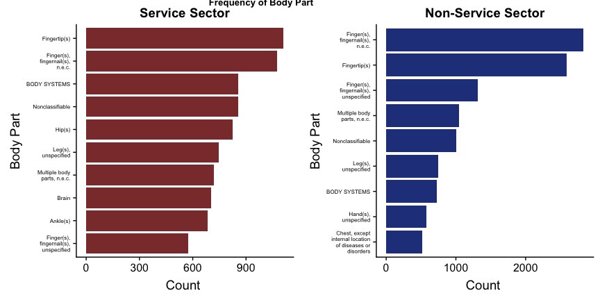
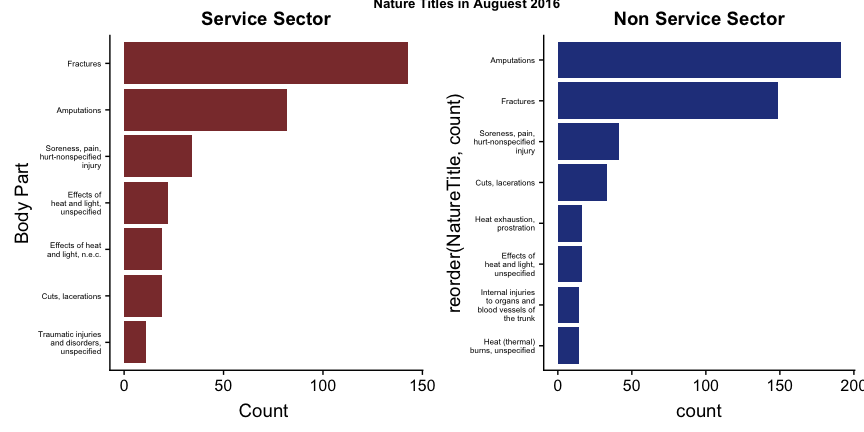

5 Facts Static
================

-   [Data Set](#data-set)
    -   [Packages](#packages)
    -   [Import Data](#import-data)
    -   [Cleaning](#cleaning)
        -   [Missing Data](#missing-data)
        -   [Duplicate Data](#duplicate-data)
-   [Non Service and Service Jobs](#non-service-and-service-jobs)
    -   [Naics Code Digit Checks](#naics-code-digit-checks)
    -   [Seperate the data sets into Service and NonService](#seperate-the-data-sets-into-service-and-nonservice)
-   [Fun Facts](#fun-facts)
    -   [Fact 1: Percentage Hospitalized Injuries in Service and NonService Job Sectors](#fact-1-percentage-hospitalized-injuries-in-service-and-nonservice-job-sectors)
    -   [Fact 2: Amputations](#fact-2-amputations)
    -   [Fact 3: Top 10 Nature Titles for Service and Non Service](#fact-3-top-10-nature-titles-for-service-and-non-service)
    -   [Fact 4: Body Parts](#fact-4-body-parts)
    -   [Fact 5: Time Data](#fact-5-time-data)
        -   [BONUS: What happened in August of 2016?](#bonus-what-happened-in-august-of-2016)
    -   [Fact 6: Are the most popular states for service injuries the same as the most popular states for non service injuires?](#fact-6-are-the-most-popular-states-for-service-injuries-the-same-as-the-most-popular-states-for-non-service-injuires)
-   [ONET Data Fact](#onet-data-fact)
    -   [Import Data Set](#import-data-set)
    -   [Fact 7: Which Occupations have the highest Very Hot or Cold Temperatures?](#fact-7-which-occupations-have-the-highest-very-hot-or-cold-temperatures)
-   [Conclusion](#conclusion)

Data Set
========

For the first section of our project, we are focusing on the OSHA data set and separating the jobs into service sector jobs and non-service sector jobs. All of my code and the data set are available directly on Alli's github <https://github.com/zembrodta/DSCCapstone>.

Packages
--------

I am using the tidyverse for basic cleaning. Lubridate for making handling dates easier. Plotly to make ggplot visualizations interactive. Knitr to make easy tables in Rmarkdown. Reshape2 to transform some of our data. These will all need to be installed in order for this code to be runnable.

Import Data
-----------

The following code imports our data set. Right off the bat we decided to remove the column Address2, and Inspection because they were mostly null. We also made sure to convert the eventdate column into a data format and make the ID column a character because there are some weird values which made it not numeric. I also added columns for month and year so we could do some analysis based on time of year.

``` r
 severeinjury <- read_csv("~/Documents/GitHub/DSCCapstone/datasets/severeinjury.csv", 
    col_types = cols(Address2 = col_skip(), 
    EventDate = col_date(format = "%m/%d/%Y"), 
    ID = col_character(), Inspection = col_skip()))
colnames(severeinjury)[colnames(severeinjury)=="Primary NAICS"] <- "naics"
colnames(severeinjury)[colnames(severeinjury)=="Part of Body Title"] <- "bodyPart"
severeinjury$month = month(severeinjury$EventDate)
severeinjury$year= year(severeinjury$EventDate)
```

Cleaning
--------

Now that our dataset is imported, we would like to check to see if data has duplicate values of any nulls or duplicate values.

### Missing Data

Let's print out a complete summary of the number of missings in each column. The code below summarizes each column and counts the number of nulls.

``` r
Nulls= severeinjury%>%
  summarise_all(funs(sum(is.na(.))))
Nulls=melt(Nulls)
kable(Nulls)
```

| variable               |  value|
|:-----------------------|------:|
| ID                     |      0|
| UPA                    |      0|
| EventDate              |      0|
| Employer               |      0|
| Address1               |     11|
| City                   |     11|
| State                  |      0|
| Zip                    |     13|
| Latitude               |      4|
| Longitude              |      4|
| naics                  |      3|
| Hospitalized           |      0|
| Amputation             |      2|
| Final Narrative        |      0|
| Nature                 |      0|
| NatureTitle            |      0|
| Part of Body           |      0|
| bodyPart               |      0|
| Event                  |      0|
| EventTitle             |      0|
| Source                 |      0|
| SourceTitle            |      0|
| Secondary Source       |  23509|
| Secondary Source Title |  23509|
| month                  |      0|
| year                   |      0|

For the most part our data looks pretty good. There are two columns that are about 60% null, but those are about secondary sources. It would make sense for secondary source to be mainly null, because sometimes there are not always two sources. For right now, I am going to leave those columns because we aren't really using them.

What I am more concerned about is the 3 nulls in the NAISC code column. Since we are going to be breaking up the records into two different files, the service sector and the non-service sector, we will need to get rid of those. I will use the function, drop\_na in the tidyverse to remove these values. I am also going to get rid of the 2 null values in the amputation column because we may use that for some analysis and it will mess up any counting and averaging.

``` r
severeinjury = severeinjury %>%
  drop_na(naics, Amputation)
```

### Duplicate Data

Since the id column should be unique, I am going to check to make sure the number of rows in the severeInjury data equals the number of unique Ids.

``` r
length(unique(severeinjury$ID))
```

    ## [1] 32117

``` r
nrow(severeinjury)
```

    ## [1] 32122

There are 5 id values that are the same. So, ID is either not unique or we have some duplicates. Let's investigate further.

``` r
NotUniqueIDs = severeinjury %>%
  group_by(ID) %>%
  summarise( count = n()) %>%
  filter( count >1)

SameIDs = severeinjury %>%
  filter( ID == "2015010015" | ID == "2015010016" | ID == "2015010018" |ID =="2015010020" | ID =='2015010021') %>% select (ID, EventDate, Employer, City, State, bodyPart) 
SameIDs = SameIDs[order(SameIDs$ID),]
kable(SameIDs)
```

| ID         | EventDate  | Employer                                       | City        | State        | bodyPart                         |
|:-----------|:-----------|:-----------------------------------------------|:------------|:-------------|:---------------------------------|
| 2015010015 | 2015-01-01 | FCI Otisville Federal Correctional Institution | OTISVILLE   | NEW YORK     | Lower leg(s)                     |
| 2015010015 | 2015-01-19 | Lochridge Priest, Inc.                         | WACO        | TEXAS        | Thigh(s)                         |
| 2015010016 | 2015-01-01 | Kalahari Manufacturing LLC                     | LAKE DELTON | WISCONSIN    | Leg(s), n.e.c.                   |
| 2015010016 | 2015-01-26 | HDA Motors, Inc. dba Continental Honda         | COUNTRYSIDE | ILLINOIS     | Brain                            |
| 2015010018 | 2015-01-01 | Schneider National Bulk Carrier                | CORAOPOLIS  | PENNSYLVANIA | Nonclassifiable                  |
| 2015010018 | 2015-01-28 | RCS SYSTEMS, INC.                              | MILWAUKEE   | WISCONSIN    | Hand(s), unspecified             |
| 2015010020 | 2015-01-01 | North American Pipe Corporation                | JANESVILLE  | WISCONSIN    | Finger(s), fingernail(s), n.e.c. |
| 2015010020 | 2015-01-30 | Schiavone Construction Co, Inc                 | JERSEY CITY | NEW JERSEY   | Fingertip(s)                     |
| 2015010021 | 2015-01-01 | The Home Depot, Inc.                           | CAPE CORAL  | FLORIDA      | Elbow(s)                         |
| 2015010021 | 2015-01-30 | Schiavone Construction Co. LLC                 | JERSEY CITY | NEW JERSEY   | Fingertip(s)                     |

So, even though they have the same ID these are unique records. This is kind of concerning because it means that ID is not unique. I am going to do a check that NatureTitle, Day and Employer are all unique. To me, that would be a unique combination.

``` r
NatureDayEmployer = severeinjury %>%
  group_by(NatureTitle, EventDate, Employer)

nrow(NatureDayEmployer) == nrow(severeinjury)
```

    ## [1] TRUE

They are the same, so I am going to assume that we have unique values. I would like to check with the CDC/ NIOSH representatives to ensure that this was a correct assumption and make sure they are aware that ID is not completely unique.

Non Service and Service Jobs
============================

One of the big goals of our project is to see if there are any differences between service sector jobs and non-service sector jobs. We will be looking at the different types of injuries common in the two sectors, the difference in body parts, and the time of year the injuries occur. Before we begin that analysis, I we will need to separate the data set. We will be doing this by using NAICS codes.

Naics Code Digit Checks
-----------------------

I want to make sure that all the records have a full 6 digit naics code before I remove them. I saw something suspicious when I was looking through the data manually and I want to double check that everything has the correct number of digits based on the chart we are using.

``` r
severeWithdigits = severeinjury %>%
  mutate(NumberOfNaics = nchar(naics))

max(severeWithdigits$NumberOfNaics)
```

    ## [1] 6

``` r
min(severeWithdigits$NumberOfNaics)
```

    ## [1] 2

The max number of digits is 6 which is what we expected, but the minimum is 2. This is concerning, because we do not know how to interpret the 2 digit codes. Let's check how many records have less than 6 to see if it is significant enough to worry about them. The code below checks to see how many are less than 6.

``` r
sum(severeWithdigits$NumberOfNaics <= 5)
```

    ## [1] 131

There are 131 records that have naics codes that either need to be handled separately or just thrown out, for now I am going to remove them by putting them in a different data set in case we want to investigate them further later.

``` r
NotRealNaisc = severeWithdigits %>%
  filter( NumberOfNaics <= 5)

Injury = severeWithdigits %>%
  filter( NumberOfNaics == 6)
```

Seperate the data sets into Service and NonService
--------------------------------------------------

We will be using the following chart to separate our data sets. The numbers in the far-right column correspond to the first two digits of our NAICS codes. Utilities made this slightly tricky because it has a NAICS code of 22 which falls in the middle of the NonService producing numbers, but with a little work around our datasets were separated.

``` r
knitr::include_graphics('figures/NAICSCodes.PNG')
```


``` r
Utilities = Injury %>% 
  filter(naics >= 220000 & naics <230000)
  
Service = Injury %>%
  filter( naics >= 400000)

Service = rbind(Service, Utilities)

NonServiceTop = Injury %>%
  filter(naics < 400000 & naics >= 230000) 

NonServiceBottom = Injury %>%
  filter(naics < 220000)

NonService = rbind(NonServiceTop, NonServiceBottom)
```

Fun Facts
=========

After all of our cleaning, it is finally time to start looking at interesting facts in our data.

Fact 1: Percentage Hospitalized Injuries in Service and NonService Job Sectors
------------------------------------------------------------------------------

``` r
a=sum(NonService$Hospitalized)/nrow(NonService)
b= sum(Service$Hospitalized)/nrow(Service)

Sector = c( 'NonService', 'Service' )
Percentage = c( a, b)

HospitalizationPercentage = data.frame( Sector, Percentage)
kable( HospitalizationPercentage)
```

| Sector     |  Percentage|
|:-----------|-----------:|
| NonService |   0.7574010|
| Service    |   0.8735039|

There is quite a big difference in the hospitalizations recorded between the non-service sector and the service sector. This would require some domain knowledge in order to interpret, but it is the opposite of what you would expect. Non-service jobs are traditionally "more dangerous" and would be believed to cause more injuries. What may be happening is that only the major injuries of the Service fields are being recorded and most of those require trips to the hospital.

Fact 2: Amputations
-------------------

``` r
c= sum(NonService$Amputation)/nrow(NonService)
d= sum(Service$Amputation)/nrow(Service)

Sector = c( 'NonService', 'Service' )
Percentage = c( c, d)

AmputationPercentage = data.frame( Sector, Percentage)
kable( AmputationPercentage)
```

| Sector     |  Percentage|
|:-----------|-----------:|
| NonService |   0.3395609|
| Service    |   0.1804630|

This proportion makes sense to us. The nonService sectors are generally more dangerous, so it seems likely that they have the higher amputation rate. The amputation rates seem very high. This is probably due to the fact that amputations are something that must be reported, so it makes sense that they take up a large portion of our data. However, this may be a data quality issue if in reality our proportion on amputations is just being inflated because they must be reported.

Fact 3: Top 10 Nature Titles for Service and Non Service
--------------------------------------------------------

Note: Throughout the document all NonService sector jobs will be represented in blue and Service sector jobs will be in red.

``` r
Top10Service = Service %>%
  group_by(NatureTitle) %>%
  summarize( countSer = n()) %>%
  filter(countSer > 190) %>%
  mutate(sector = "NonService") %>%
  mutate(NatureTitle = str_wrap(NatureTitle, width = 18)) 

p1 = ggplot(Top10Service, aes(reorder(NatureTitle, countSer), countSer))+geom_bar(stat= "identity", fill = "indianred4")+coord_flip()+ labs (y = "Count ", x = "Injury", title= "Service Sector")+ theme(axis.text.y = element_text(size=6)) 
Top10NonService = NonService %>%
  group_by(NatureTitle) %>%
  summarize( countNon = n()) %>%
  filter(countNon > 250) %>%
  mutate(sector = "NonService") %>%
  mutate(NatureTitle = str_wrap(NatureTitle, width = 18)) 

p2 = ggplot(Top10NonService, aes(reorder(NatureTitle, countNon), countNon))+geom_bar(stat= "identity", fill = 'royalblue4')+ labs (y = "Count ", x = "Injury", title = "Non-Service Sector")+coord_flip()+ theme(axis.text.y = element_text(size=6))


plot_grid(p1, p2, ncol = 2, labels = "Frequency of Nature Title", vjust = .8, hjust = -2, label_size = 10)
```


The top categories are different in the Service and NonService sector. In the NonService amputations are the most common injury, but in the service sector fractures are the most common. Some other stand out differences are that internal injuries are more common to NonService and Heat injuries and burns are less common in the Service sector. It will be interesting to dive a little deeper into the exact body parts of the injuries and see if there are any more differences.

Fact 4: Body Parts
------------------

``` r
Top10BodyPartService = Service %>%
  group_by(bodyPart) %>%
  summarize( count = n()) %>%
  filter(count >500) %>%
  mutate(bodyPart = str_wrap(bodyPart, width = 18)) 


p3= ggplot(Top10BodyPartService, aes(reorder(bodyPart, count), count))+geom_bar(stat= "identity", fill ="indianred4" )+coord_flip()+labs (y = "Count ", x = "Body Part", title = "Service Sector")+coord_flip()+ theme(axis.text.y = element_text(size=6))


Top10BodyPartNonService = NonService %>%
  group_by(bodyPart) %>%
  summarize( count = n()) %>%
  filter(count >500) %>% 
  mutate(bodyPart = str_wrap(bodyPart, width = 18)) 

p4= ggplot(Top10BodyPartNonService, aes(reorder(bodyPart, count), count))+geom_bar(stat= "identity", fill = 'royalblue4' )+coord_flip()+labs (y = "Count ", x = "Body Part", title = "Non-Service Sector")+coord_flip()+ theme(axis.text.y = element_text(size=6))

plot_grid( p3, p4, labels = "Frequency of Body Part", vjust = .8, hjust = -2, label_size = 10) 
```



Overwhelmingly fingers and finger tips are the most common body part injured. Most work involves your hands, so this falls in line with what one would expect. Hip injuries appear on Service, but not on NonService. This may be people in offices that are falling. Ankles and Brain also are high on the number of injuries for Service workers. Chest injuries are common in NonService injuries, but that does not show up in the top 10 for Service. There are some big differences in the body parts that are injured between the service and the non service sector. Hands, fingers, legs, and the chest are some of the most common for Non Service work. While for Service, fingers, Hips, Brain, and Ankles are some of the more common.

Fact 5: Time Data
-----------------

Lets look and see if there are any points from the last 3 years that have extremely high points of data.

``` r
ServiceDate = Service %>%
  group_by(month,year) %>%
  filter( year < 2018) %>% 
  summarize(numInjuries = n()) %>%
  mutate(FullDate = paste(month,year, sep = "/"))

NonServiceDate = NonService %>%
  group_by(month,year) %>%
  filter( year < 2018) %>% 
  summarize(numInjuries = n()) %>%
  mutate(FullDate = paste(month,year, sep = "/"))

ggplot()+ geom_line(data=ServiceDate, aes(group=1,x= month,y= numInjuries), color = "indianred4")+ geom_line(data=NonServiceDate, aes(group=1,x= month,y= numInjuries), color = "royalblue4")+facet_wrap(~ year, ncol = 4)+ labs( title = "Number of Injuries Over Time")
```



Something interesting about this is they follow a very similar pattern. That really isn't something I would expect. I would have thought that they would be a bit more random, however the trends seem to follow each other. This makes me think there is some outside force that is making them do more reports that month. We seem to see spikes in September and October. One inital thought is that those are some of the hotter months, so there could be a rise in heat stokes and dehydration. I would like to follow up and get more information on what happened in August of 2016 to cause such a huge spike.

### BONUS: What happened in August of 2016?

``` r
Top10ServiceAug2016 = Service %>%
  filter(month == 8, year == 2016) %>%
  group_by(NatureTitle) %>%
  summarize( countSer = n()) %>%
  filter(countSer>9)%>%
  mutate(NatureTitle = str_wrap(NatureTitle, width = 18)) 
  

p6 = ggplot(Top10ServiceAug2016, aes(reorder(NatureTitle, countSer), countSer))+geom_bar(stat= "identity", fill ="indianred4" )+coord_flip()+labs (y = "Count ", x = "Body Part", title = "Service Sector")+coord_flip()+ theme(axis.text.y = element_text(size=6))

Top10NonServiceAug2016 = NonService %>%
  filter(month == 8, year == 2016) %>%
  group_by(NatureTitle) %>%
  summarize( count = n()) %>%
  filter(count >13)%>%
  mutate(NatureTitle = str_wrap(NatureTitle, width = 18)) 
  

p7 = ggplot(Top10NonServiceAug2016, aes(reorder(NatureTitle, count), count))+geom_bar(stat= "identity" ,fill = "royalblue4")+coord_flip()+ labs( title = 'Non Service Sector')+ theme(axis.text.y = element_text(size=6))

plot_grid( p6, p7, labels = "Nature Titles in Auguest 2016", vjust = .8, hjust = -2, label_size = 10)
```


We see a lot more heat and light injuries, I wonder if the temperature was extremely high that year in September? This would be a situation where outside weather data would provide more background.

Fact 6: Are the most popular states for service injuries the same as the most popular states for non service injuires?
----------------------------------------------------------------------------------------------------------------------

To accomplish this, I decided it would be easier to rank the states by number of records. So, if a state is ranked 1 that means that state has the greatest number of records, or injuries. If a state is ranked in the 50s that means, there were hardly any injuries recorded. Surprisingly, there are some states like New Jersey that rank very high in amount of Service injuries (8), but it is ranked in the middle for NonService (18). The differences between where the states fall in the non service and service states probably has something to do with the job markets in those areas.

``` r
ServiceStates = Service %>%
  group_by(State) %>%
  summarise(ServiceRecords = n())
NonServiceStates = NonService %>%
  group_by(State)%>%
  summarise(NonServiceRecords = n())
StatesRecords = left_join(ServiceStates, NonServiceStates)
#View(StatesRecords)
```

``` r
ServiceStates$ServiceRank= NA
ServiceStates$ServiceRank[order(-ServiceStates$ServiceRecords)]= 1:nrow(ServiceStates)

NonServiceStates$NonServiceRank= NA
NonServiceStates$NonServiceRank[order(-NonServiceStates$NonServiceRecords)]= 1:nrow(NonServiceStates)


StateRecords = left_join(ServiceStates, NonServiceStates)
```

``` r
StateRecords = StateRecords %>%
  select(State,ServiceRank, NonServiceRank)
StateRecords = StateRecords[order(StateRecords$ServiceRank),]

StateRecordsDiff = StateRecords %>%
  mutate( difference = abs(ServiceRank-NonServiceRank))

kable(StateRecordsDiff)
```

| State                    |  ServiceRank|  NonServiceRank|  difference|
|:-------------------------|------------:|---------------:|-----------:|
| TEXAS                    |            1|               1|           0|
| FLORIDA                  |            2|               2|           0|
| PENNSYLVANIA             |            3|               4|           1|
| OHIO                     |            4|               3|           1|
| ILLINOIS                 |            5|               5|           0|
| NEW YORK                 |            6|               8|           2|
| GEORGIA                  |            7|               6|           1|
| NEW JERSEY               |            8|              18|          10|
| COLORADO                 |            9|              10|           1|
| MISSOURI                 |           10|              11|           1|
| MASSACHUSETTS            |           11|              17|           6|
| WISCONSIN                |           12|               7|           5|
| LOUISIANA                |           13|              13|           0|
| ALABAMA                  |           14|               9|           5|
| ARKANSAS                 |           15|              12|           3|
| KANSAS                   |           16|              16|           0|
| OKLAHOMA                 |           17|              14|           3|
| NEBRASKA                 |           18|              19|           1|
| MISSISSIPPI              |           19|              15|           4|
| CONNECTICUT              |           20|              23|           3|
| CALIFORNIA               |           21|              32|          11|
| MAINE                    |           22|              25|           3|
| WEST VIRGINIA            |           23|              22|           1|
| IDAHO                    |           24|              21|           3|
| NORTH DAKOTA             |           25|              20|           5|
| NEW HAMPSHIRE            |           26|              27|           1|
| MONTANA                  |           27|              28|           1|
| SOUTH DAKOTA             |           28|              24|           4|
| DISTRICT OF COLUMBIA     |           29|              31|           2|
| VIRGINIA                 |           30|              29|           1|
| RHODE ISLAND             |           31|              30|           1|
| DELAWARE                 |           32|              26|           6|
| WASHINGTON               |           33|              33|           0|
| TENNESSEE                |           34|              40|           6|
| ARIZONA                  |           35|              37|           2|
| MARYLAND                 |           36|              35|           1|
| MICHIGAN                 |           37|              51|          14|
| NORTH CAROLINA           |           38|              36|           2|
| NEW MEXICO               |           39|              46|           7|
| OREGON                   |           40|              38|           2|
| UTAH                     |           41|              50|           9|
| SOUTH CAROLINA           |           42|              39|           3|
| MINNESOTA                |           43|              52|           9|
| HAWAII                   |           44|              41|           3|
| INDIANA                  |           45|              NA|          NA|
| KENTUCKY                 |           46|              34|          12|
| IOWA                     |           47|              NA|          NA|
| WYOMING                  |           48|              45|           3|
| ALASKA                   |           49|              43|           6|
| GUAM                     |           50|              42|           8|
| NEVADA                   |           51|              NA|          NA|
| VERMONT                  |           52|              NA|          NA|
| NORTHERN MARIANA ISLANDS |           53|              48|           5|
| AMERICAN SAMOA           |           54|              44|          10|
| PUERTO RICO              |           55|              49|           6|

ONET Data Fact
==============

We have barely touched the surface of this data set. It took us a long time to realize what was the best way to read/interpret it. We decided to only use the columns for title, SOC number, Element ID, Element Name, and Data Value. These are the values we know how to interpret right now, so these are what we will be using. For a basic fact, we wanted to see the top 5 jobs that involve working in extreme temperatures.

Import Data Set
---------------

``` r
WorkContext <- read_excel("~/Downloads/Work Context.xlsx")

WorkContext = WorkContext %>%
  filter( WorkContext$`Scale Name` == "Context")
```

Fact 7: Which Occupations have the highest Very Hot or Cold Temperatures?
-------------------------------------------------------------------------

``` r
HotCold = WorkContext %>%
  filter( `Element Name` == "Very Hot or Cold Temperatures")

Top5HotCold = HotCold %>%
  filter(`Data Value` >4.73) %>%
  select( Title, `Element Name`, `Data Value`)

Top5HotCold = Top5HotCold[order(Top5HotCold$`Data Value`),]
kable(Top5HotCold)
```

| Title                                              | Element Name                  |  Data Value|
|:---------------------------------------------------|:------------------------------|-----------:|
| Landscaping and Groundskeeping Workers             | Very Hot or Cold Temperatures |        4.74|
| Refractory Materials Repairers, Except Brickmasons | Very Hot or Cold Temperatures |        4.74|
| Metal-Refining Furnace Operators and Tenders       | Very Hot or Cold Temperatures |        4.82|
| Sailors and Marine Oilers                          | Very Hot or Cold Temperatures |        4.93|
| Pourers and Casters, Metal                         | Very Hot or Cold Temperatures |        4.98|

Conclusion
==========

Splitting the injuries data set has led us to some very interesting conclusions. There is clearly a difference in the amount of injuries, nature of injuries, and parts of the body that they affect. Once we are able to dig deeper into our data, we will be able to come up with even more visualizations to showcase the differences between the service and non-service sector jobs and hopefully come up with our interactive dashboard to allow the user to narrow down into specific jobs they are interested in.
